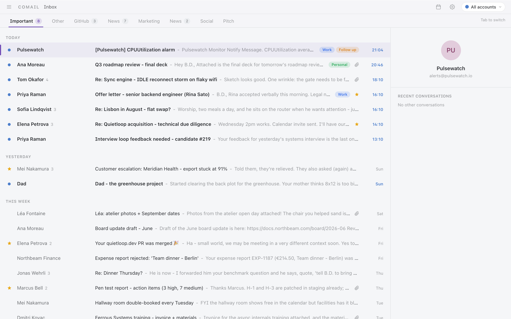
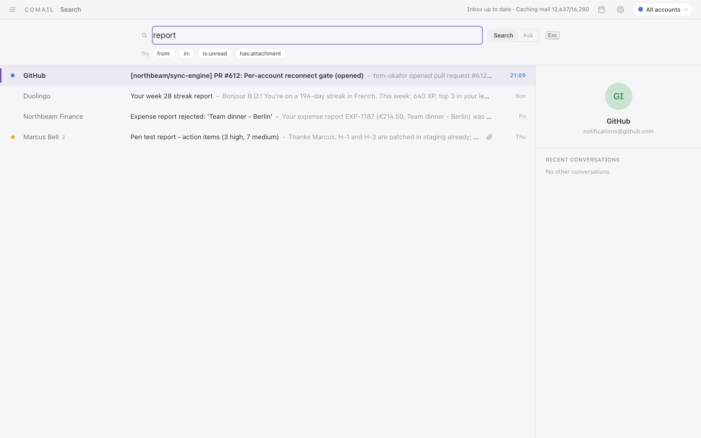
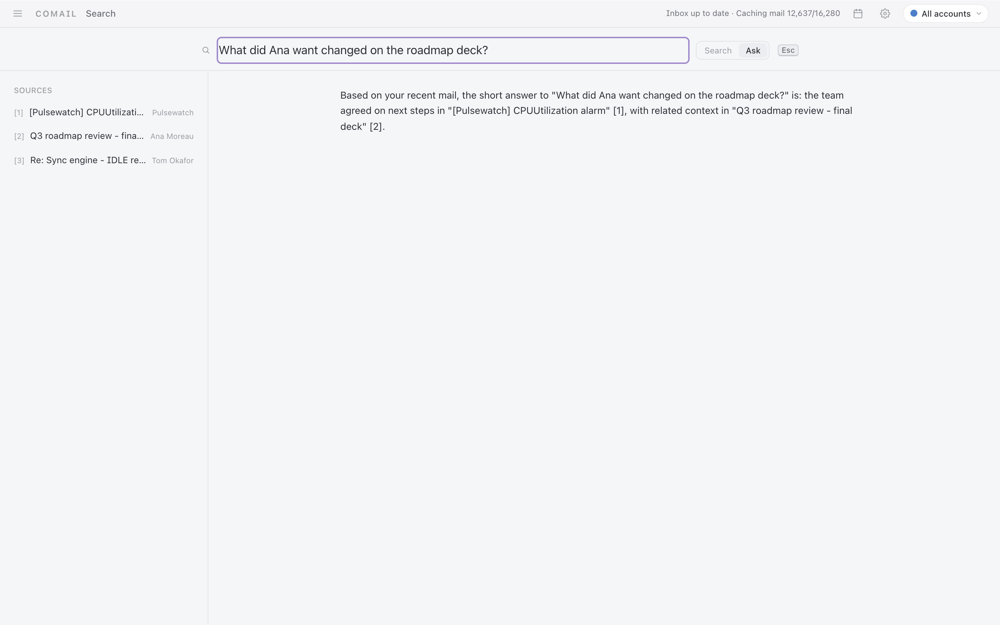
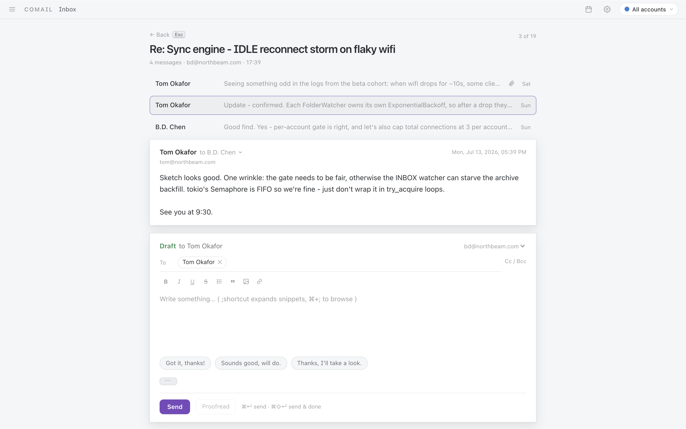

# Comail

Email that keeps up with you.

Comail is a fast, keyboard-driven mail client for Mac, Windows, and Linux. Your
whole mailbox lives on your computer, so everything opens instantly, search
finds what you *meant*, and it all keeps working on a plane. No account, no
subscription, no telemetry — free and open source.

## Get Comail

Grab the installer for your platform from the
[latest release](https://github.com/NextOSP/comail/releases/latest):

- **macOS** — `.dmg` (universal, Apple Silicon and Intel)
- **Windows** — `.msi` or setup `.exe`
- **Linux** — `.deb` or `.AppImage`

Comail keeps itself up to date: it checks for new releases on launch and
installs them in place after asking you.

Works with **Gmail**, **Microsoft 365 / Outlook**, and any **IMAP** provider
(Fastmail, iCloud, self-hosted, your company server). Regular IMAP accounts
just need an app password — no setup at all.

## Fly through your inbox

- **Everything is a keystroke.** `J`/`K` to move, `E` to mark done, `H` to
  snooze, `C` to compose, `?` shows every shortcut. Your hands never leave the
  keyboard.
- **A command palette for the rest.** `Cmd/Ctrl+K` finds any action by name —
  even plain language like "archive everything from LinkedIn" works.
- **Split inbox.** Important mail and everything else land in separate tabs,
  plus your own rules — newsletters, receipts, alerts — so the inbox you look
  at is only the mail that matters.
- **Snooze, send later, undo send.** Make mail come back when you can deal with
  it, schedule sends, and actually cancel a send you regret — the message
  doesn't leave for a few seconds, and Comail can really stop it.
- **Triage in bulk.** Select a batch with the keyboard or a drag, then archive,
  label, or snooze them all at once. Every action works offline and syncs when
  you're back.

## Search that finds it

- **Ask in your own words.** "What did Ana want changed on the roadmap deck"
  finds the right thread even if it never used those words. The understanding
  happens on your machine — nothing is sent anywhere.
- **Or be precise.** Instant keyword search with `from:`, `in:`, `is:unread`,
  `has:attachment`, and `exclude:` filters. Sender searches rank people you
  actually talk to first.
- **Ask AI about your inbox.** Optional: connect an AI and ask questions across
  your mail, with cited sources you can click straight into.

## All your accounts, one calm app

- **Every account in one place**, each with its own color so a multi-account
  setup never blurs into one anonymous pile. Jump to any account with
  `Ctrl+1`–`9`.
- **Conversations that read like conversations.** Threads stack up cleanly,
  replies happen inline right under the message, and snippets fill in the
  sentences you type every day.
- **Attachments without the detour.** PDFs, Word, Excel, PowerPoint, CSVs, and
  images preview right in the app. Alt-click opens them externally.
- **See who really sent it.** Expand any message to see the full details — and
  a "via" line whenever a service sent mail on someone else's behalf, so
  spoofed or on-behalf-of senders are obvious instead of hidden.
- **One-key unsubscribe.** `Cmd+U` on any newsletter.
- **Lives in the tray.** Keeps syncing after you close the window, shows an
  unread badge on the dock, and plays a short (optional) chime only for
  genuinely new mail — never for the backlog it downloads when you reopen it.

## A real calendar, built in

- **Week and month views** one keystroke away (`2` full screen, `0` for a quick
  peek). Click or drag to create; drag to move and resize.
- **Type events like you'd say them.** "Lunch with Ana tuesday 12:30" becomes
  an event — timezone-aware, in any language with the optional AI.
- **Invites just work.** Meeting invitations show up as RSVP cards inside the
  thread; accepting, editing, or cancelling emails the attendees for you.
  Reminders arrive as native notifications, and you can paste your free slots
  into any email.
- **Syncs both ways** with Google Calendar, Fastmail, iCloud, or any CalDAV
  server. Edits made offline push when you reconnect.

## AI on your terms

All AI features are optional and work with any OpenAI-compatible provider —
including a local one like LM Studio. Bring your own key, pick which model
handles which job, or use none of it.

- **Summaries** of long threads on one key.
- **Reply drafting in your voice**, learned from your own sent mail.
- **Proofreading** before you send.
- **Plain-language commands** and inbox Q&A with cited sources.

## Private by design

- **Your mail stays on your machine** — the full mailbox syncs into a local
  database, and search (including the semantic kind) runs entirely on-device.
- **Credentials live in the OS keyring**, never in a file.
- **Offline is a feature, not an error.** Read, search, write, and triage with
  no connection; everything replays when you're back.
- **No account, no telemetry, no subscription.** Free software under the AGPL.

## Looks right anywhere

Snow and Carbon themes in light and dark, a UI in English, Spanish, French,
Chinese, and Vietnamese, and native builds for all three desktop platforms.
Conversations read as a clean stack with replies inline:

## A note on first launch

If your build warns about an unidentified developer: on macOS, right-click the
app and choose Open once (or run
`xattr -dr com.apple.quarantine /Applications/Comail.app`); on Windows, choose
More info → Run anyway in SmartScreen.

## Gmail and Microsoft accounts

Gmail and Microsoft 365 sign in with OAuth using your own (free) app
registration — a one-time, ten-minute setup with a full walkthrough in
[docs/oauth-setup.md](docs/oauth-setup.md). Everyone else just uses an app
password.

## For developers

Comail is built on Tauri 2 — a Rust core with a React front end. Setup, tests,
architecture notes, and the release process live in
[docs/DEVELOPMENT.md](docs/DEVELOPMENT.md), with contribution conventions in
[CONTRIBUTING.md](CONTRIBUTING.md).

## License

Comail is free software, released under the GNU Affero General Public License
v3.0. See [LICENSE](LICENSE).
